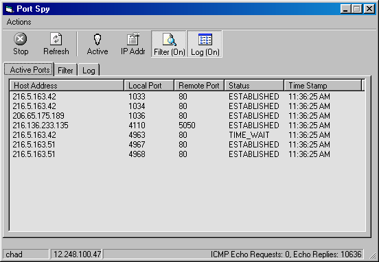



## IP ICMP Port Spy and Firewall

### Description

I was looking for a way to block IP addresses and ports when I found this code out on the web somewhere. It was done by Gregory Kirk, I don't know him but this code is great for a personal firewall.
 
### More Info
 

             |
---                |---
**Submitted On**   |2002-07-31 11:33:42
**By**             |[Chad Gutowsky](https://github.com/Planet-Source-Code/PSCIndex/blob/master/ByAuthor/chad-gutowsky.md)
**Level**          |Advanced
**User Rating**    |5.0 (25 globes from 5 users)
**Compatibility**  |VB 6\.0
**Category**       |[Complete Applications](https://github.com/Planet-Source-Code/PSCIndex/blob/master/ByCategory/complete-applications__1-27.md)
**World**          |[Visual Basic](https://github.com/Planet-Source-Code/PSCIndex/blob/master/ByWorld/visual-basic.md)
**Archive File**   |[IP\_ICMP\_Po1128827312002\.zip](https://github.com/Planet-Source-Code/chad-gutowsky-ip-icmp-port-spy-and-firewall__1-37451/archive/master.zip)

